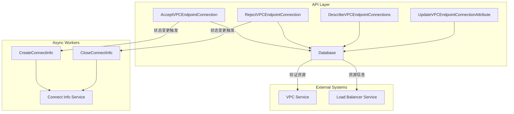
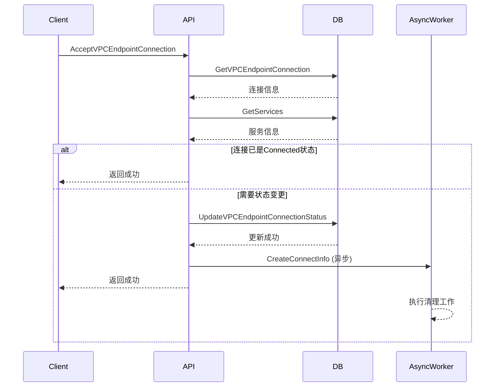
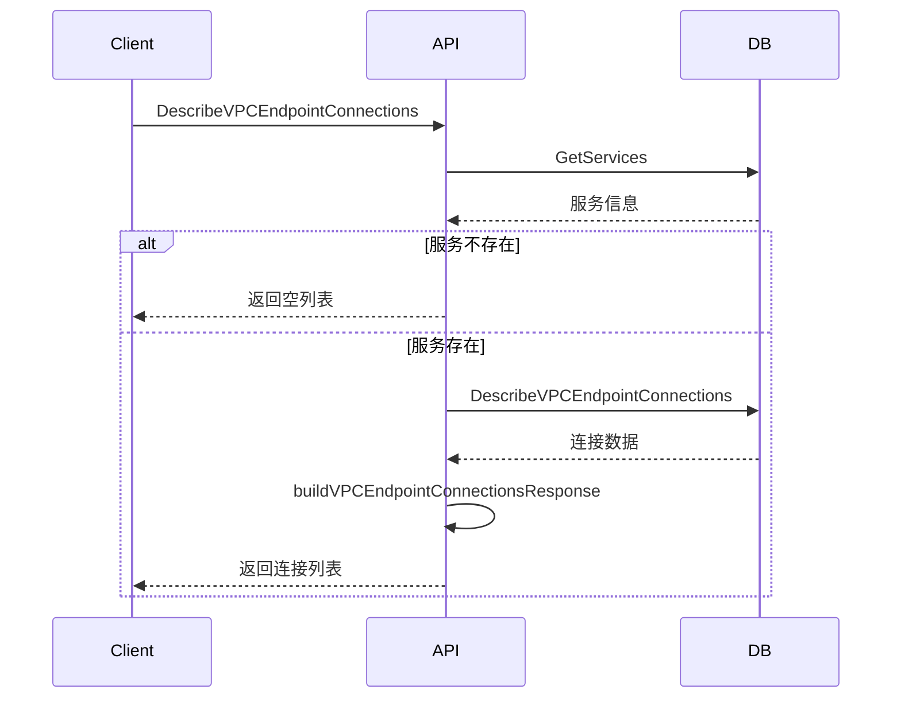
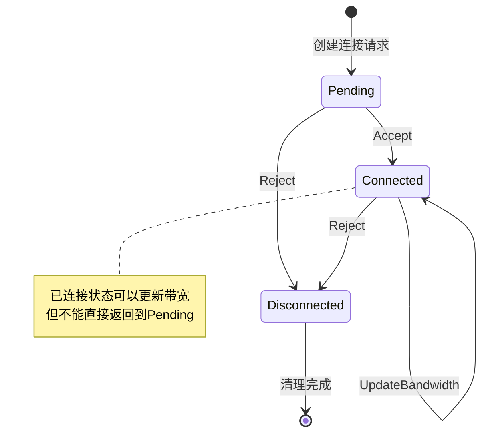

%% state: pending-review | confidence: 7 | type: architecture | sources: privatelink/apisvr | stage: L1 | agent: writer | created: 2026-06-29 %%

# 连接管理架构设计

## 概述

连接管理模块是 PrivateLink API Server 的核心组件之一，负责管理终端节点与终端节点服务之间的连接生命周期。本文档描述连接管理模块的架构设计、组件交互和数据流。

## 架构图



## 核心组件

### 1. API 接口层

#### 连接控制接口
- **AcceptVPCEndpointConnection**：接受连接请求 [[源文件:/raw/assets/repo/privatelink/apisvr/api/AcceptVPCEndpointConnection.go:L30-L83]]
- **RejectVPCEndpointConnection**：拒绝连接请求 [[源文件:/raw/assets/repo/privatelink/apisvr/api/RejectVPCEndpointConnection.go:L26-L73]]

#### 查询接口
- **DescribeVPCEndpointConnections**：查询连接列表 [[源文件:/raw/assets/repo/privatelink/apisvr/api/DescribeVPCEndpointConnections.go:L48-L94]]

#### 属性管理接口
- **UpdateVPCEndpointConnectionAttribute**：更新连接带宽 [[源文件:/raw/assets/repo/privatelink/apisvr/api/UpdateVPCEndpointConnectionAttribute.go:L28-L70]]

### 2. 数据库层

#### 核心数据表
- **TVpcEndpoint**：终端节点连接表
  - 存储连接状态、带宽等核心属性
  - 支持按服务ID、所有者、状态过滤查询

#### 查询接口
- **GetVPCEndpointConnection**：查询特定连接 [[源文件:/raw/assets/repo/privatelink/apisvr/api/AcceptVPCEndpointConnection.go:L38]]
- **DescribeVPCEndpointConnections**：查询连接列表 [[源文件:/raw/assets/repo/privatelink/apisvr/api/DescribeVPCEndpointConnections.go:L81]]
- **UpdateVPCEndpointConnectionStatus**：更新连接状态 [[源文件:/raw/assets/repo/privatelink/apisvr/api/AcceptVPCEndpointConnection.go:L73]]
- **UpdateVPCEndpointConnectionBandwidth**：更新连接带宽 [[源文件:/raw/assets/repo/privatelink/apisvr/api/UpdateVPCEndpointConnectionAttribute.go:L64]]

### 3. 异步工作器

#### 连接信息管理
- **CreateConnectInfo**：创建连接信息 [[源文件:/raw/assets/repo/privatelink/apisvr/api/common.go:L265-L271]]
- **CloseConnectInfo**：关闭连接信息 [[源文件:/raw/assets/repo/privatelink/apisvr/api/common.go:L273-L288]]

#### 异步执行策略
- 使用 `go` 关键字异步执行 [[源文件:/raw/assets/repo/privatelink/apisvr/api/AcceptVPCEndpointConnection.go:L80]]
- 失败时仅记录日志，不影响主流程
- 仅在特定条件下触发（非停服状态且状态变更）

## 数据流

### 连接接受流程



### 连接查询流程



## 状态管理

### 状态机设计



### 状态常量定义

| 状态 | 数值 | 字符串 | 描述 |
|------|-----|-------|------|
| Pending | 0 | "Pending" | 等待接受 |
| Connected | 1 | "Connected" | 已连接 |
| Disconnected | 2 | "Disconnected" | 已拒绝/断开 |
| ServiceDeleted | 100 | "ServiceDeleted" | 服务已删除 |

[[源文件:/raw/assets/repo/privatelink/apisvr/api/convert.go:L23-L34]]

### 状态转换函数

- **GetConnectStatusCode**：字符串→数值 [[源文件:/raw/assets/repo/privatelink/apisvr/api/convert.go:L105-L118]]
- **GetConnectStatusName**：数值→字符串 [[源文件:/raw/assets/repo/privatelink/apisvr/api/convert.go:L120-L133]]

## 带宽管理

### 范围限制
- **最小值**：100 Mbps
- **最大值**：10000 Mbps
- **单位**：Mbps（兆比特每秒）

[[源文件:/raw/assets/repo/privatelink/apisvr/api/AcceptVPCEndpointConnection.go:L21-L22]]

### 默认值策略
- 用户未指定时使用服务的默认连接带宽 [[源文件:/raw/assets/repo/privatelink/apisvr/api/AcceptVPCEndpointConnection.go:L66-L68]]
- 带宽为0时不进行实际更新 [[源文件:/raw/assets/repo/privatelink/apisvr/api/UpdateVPCEndpointConnectionAttribute.go:L61-L63]]

## 异步处理机制

### 异步任务触发条件

```go
if endpoint.CloseStatus != CloseStatus && endpoint.ConnectStatus != ConnectStatusConnectedInt {
    go a.CreateConnectInfo(ctx, endpoint.EndpointID, service.ServiceID)
}
```

[[源文件:/raw/assets/repo/privatelink/apisvr/api/AcceptVPCEndpointConnection.go:L78-L81]]

### 条件说明
1. **非停服状态**：`endpoint.CloseStatus != CloseStatus`
2. **状态变更**：`endpoint.ConnectStatus != ConnectStatusConnectedInt`
3. **异步执行**：避免阻塞API响应

## 安全与验证

### 资源验证
1. **存在性验证**：查询终端节点和服务是否存在
2. **唯一性验证**：确保没有重复的资源ID
3. **状态验证**：检查当前状态和预期操作是否匹配

### 权限验证
- 继承自 `ReqBase` 的权限验证
- 服务级别的访问控制

### 输入验证
- 结构体标签验证（`validate` 标签）
- 业务逻辑验证（带宽范围、状态值等）

## 扩展性设计

### 过滤条件扩展
- 当前支持按 `Owner` 和 `ConnectionStatus` 过滤
- 可通过扩展数据库查询条件支持更多过滤维度

### 状态扩展
- 预留了 `ServiceDeleted` 状态（100）
- 可通过扩展状态常量支持更多状态

### 异步任务扩展
- 可扩展更多的异步清理任务
- 可支持异步任务的状态跟踪和重试

## 性能考虑

### 数据库优化
- 索引设计：`(ServiceID, EndpointID)` 复合索引
- 分页查询：支持 `Offset`/`Limit` 分页
- 批量查询：减少多次查询的开销

### 缓存策略
- 连接状态的缓存机制
- 服务信息的缓存复用

### 异步处理
- 耗时的清理工作异步执行
- 避免阻塞API响应

## 监控与运维

### 关键指标
1. **连接状态分布**：各状态连接的数量统计
2. **接口调用量**：各接口的调用频率
3. **错误率**：各接口的错误发生情况
4. **响应时间**：API接口的响应延迟

### 日志策略
- **结构化日志**：使用 `Errorw`/`Infow` 记录关键信息
- **调试日志**：开发环境下的详细日志
- **审计日志**：重要操作的审计跟踪

## 相关文档
- [连接管理概述](../connection_management.md)
- [数据模型](../data_models_connection.md)
- [错误处理](../connection_error_handling.md)
- [各接口详情](../interfaces/)