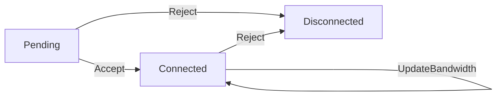

%% state: pending-review | confidence: الق | type: overview | sources: privatelink/apisvr | stage: L1 | agent: writer | created: 2026-06-29 %%

# VPC Endpoint Connection Management

## 概述

VPC Endpoint 连接管理模块负责处理终端节点与终端节点服务之间的连接生命周期管理，包括连接的接受、拒绝、查询和更新。

### 核心功能

1. **连接接受** - 接受待处理的终端节点连接请求
2. **连接拒绝** - 拒绝待处理的终端节点连接请求  
3. **连接查询** - 查询和筛选连接状态
4. **连接属性更新** - 更新连接的带宽参数

### 连接生命周期



### 连接状态定义

| 状态码 | 字符串表示 | 描述 | 对应源码常量 |
|-------|-----------|------|-------------|
| 0 | `"Pending"` | 等待接受 | `ConnectStatusPendingInt` [[源文件:/raw/assets/repo/privatelink/apisvr/api/convert.go:L30]] |
| 1 | `"Connected"` | 已连接 | `ConnectStatusConnectedInt` [[源文件:/raw/assets/repo/privatelink/apisvr/api/convert.go:L31]] |
| 2 | `"Disconnected"` | 已拒绝/断开 | `ConnectStatusDisconnectedInt` [[源文件:/raw/assets/repo/privatelink/apisvr/api/convert.go:L32]] |
| 100 | `"ServiceDeleted"` | 服务已删除 | `ConnectStatusServiceDeletedInt` [[源文件:/raw/assets/repo/privatelink/apisvr/api/convert.go:L33]] |

### 带宽管理

连接带宽范围为 **100-10000 Mbps**，单位为 Mbps [[源文件:/raw/assets/repo/privatelink/apisvr/api/AcceptVPCEndpointConnection.go:L21-L22]]。

当用户不指定连接带宽时，系统会使用服务的默认连接带宽值作为连接带宽 [[源文件:/raw/assets/repo/privatelink/apisvr/api/AcceptVPCEndpointConnection.go:L66-L68]]。

### 核心接口

| 接口 | 功能描述 | 请求参数 | 响应参数 |
|------|---------|---------|---------|
| `AcceptVPCEndpointConnection` | 接受连接请求 | `ServiceId`, `EndpointId`, `ConnectBandwidth` | 通用响应 |
| `RejectVPCEndpointConnection` | 拒绝连接请求 | `ServiceId`, `EndpointId` | 通用响应 |
| `DescribeVPCEndpointConnections` | 查询连接列表 | `ServiceId`, `Owner`, `EndpointId`, `ConnectionStatus`, `Offset`, `Limit` | `TotalCount`, `Connections` |
| `UpdateVPCEndpointConnectionAttribute` | 更新连接带宽 | `ServiceId`, `EndpointId`, `ConnectBandwidth` | 通用响应 |

### 业务逻辑

#### 连接接受流程
1. 验证终端节点和服务是否存在 [[源文件:/raw/assets/repo/privatelink/apisvr/api/AcceptVPCEndpointConnection.go:L38-L64]]
2. 检查连接状态，如果已经是已连接状态且带宽相同，直接返回成功 [[源文件:/raw/assets/repo/privatelink/apisvr/api/AcceptVPCEndpointConnection.go:L69-L71]]
3. 更新连接状态为已连接 [[源文件:/raw/assets/repo/privatelink/apisvr/api/AcceptVPCEndpointConnection.go:L73-L77]]
4. 如果终端节点未停服且之前不是已连接状态，异步创建连接信息 [[源文件:/raw/assets/repo/privatelink/apisvr/api/AcceptVPCEndpointConnection.go:L78-L81]]

#### 连接拒绝流程
1. 验证终端节点和服务是否存在 [[源文件:/raw/assets/repo/privatelink/apisvr/api/RejectVPCEndpointConnection.go:L34-L59]]
2. 检查连接状态，如果已经是已拒绝状态，直接返回成功 [[源文件:/raw/assets/repo/privatelink/apisvr/api/RejectVPCEndpointConnection.go:L61-L63]]
3. 更新连接状态为已拒绝 [[源文件:/raw/assets/repo/privatelink/apisvr/api/RejectVPCEndpointConnection.go:L64-L68]]
4. 如果终端节点未停服，异步关闭连接信息 [[源文件:/raw/assets/repo/privatelink/apisvr/api/RejectVPCEndpointConnection.go:L69-L71]]

#### 连接查询逻辑
1. 如果指定了 `EndpointId`，则忽略其他过滤条件 [[源文件:/raw/assets/repo/privatelink/apisvr/api/DescribeVPCEndpointConnections.go:L58-L62]]
2. 验证服务是否存在 [[源文件:/raw/assets/repo/privatelink/apisvr/api/DescribeVPCEndpointConnections.go:L64-L79]]
3. 查询连接列表，支持按 `Owner` 和 `ConnectionStatus` 过滤 [[源文件:/raw/assets/repo/privatelink/apisvr/api/DescribeVPCEndpointConnections.go:L81-L85]]
4. 构建响应数据 [[源文件:/raw/assets/repo/privatelink/apisvr/api/DescribeVPCEndpointConnections.go:L87-L93]]

### 错误处理

#### 通用错误场景
- **资源不存在**：终端节点或服务不存在时返回 `ResourceNotFoundErr`
- **重复资源**：查询到多个相同的资源ID时返回 `InternalServerErr`
- **参数错误**：请求参数验证失败时返回 `RequestParamsErr`
- **内部错误**：数据库操作失败时返回 `InternalServerErr`

#### 特殊错误场景
- **连接状态无变化**：连接已经是目标状态时直接返回成功
- **带宽无需更新**：新旧带宽值相同时直接返回成功

### 相关接口文档

- [AcceptVPCEndpointConnection](interfaces/AcceptVPCEndpointConnection.md)
- [RejectVPCEndpointConnection](interfaces/RejectVPCEndpointConnection.md)  
- [DescribeVPCEndpointConnections](interfaces/DescribeVPCEndpointConnections.md)
- [UpdateVPCEndpointConnectionAttribute](interfaces/UpdateVPCEndpointConnectionAttribute.md)

### 数据模型

连接信息包含以下关键字段：
- `ServiceId` - 终端节点服务ID
- `EndpointId` - 终端节点ID
- `ConnectBandwidth` - 连接带宽（Mbps）
- `ConnectionStatus` - 连接状态
- `CreateTime` - 创建时间
- `UpdateTime` - 更新时间

### 使用示例

#### 接受连接请求
```json
{
  "ServiceId": "service-123",
  "EndpointId": "endpoint-456",
  "ConnectBandwidth":106
}
```

#### 查询连接列表
```json
{
  "ServiceId": "service-123",
  "ConnectionStatus": "Pending",
  "Offset": 0,
  "Limit": 100
}
```