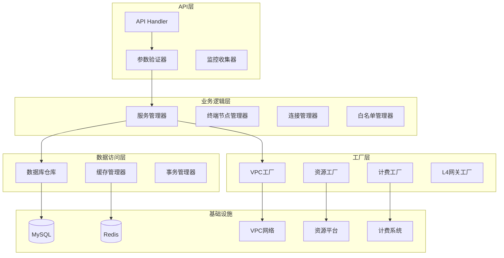
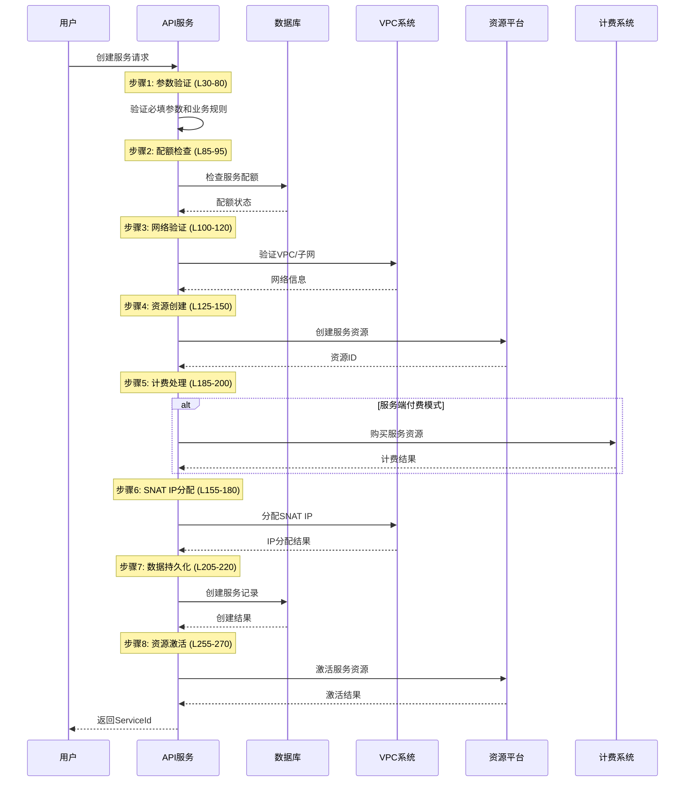
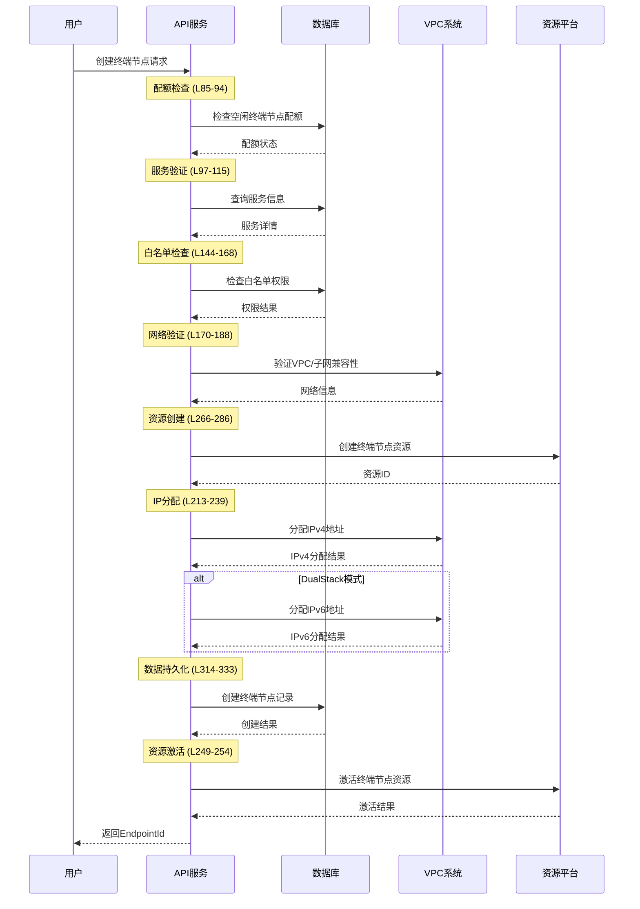

%% state: pending-review | confidence: 9 | type: architecture | sources: privatelink/apisvr | stage: L1 | agent: writer | created: 2026-06-29 %%

# PrivateLink — 核心概念与架构文档

## 1. 业务概念详解

### 1.1 VPC终端节点服务 (VPCEndpointService)
**定义**: 服务提供商在VPC中创建的网络服务，允许其他VPC通过终端节点私有连接访问。[[源文件:base.go:L51-L68]]

**核心特性**:
- **服务标识**: ServiceId唯一标识，格式plsvc-xxxxxxxx
- **资源类型**: 支持ALB、NLB、IP三种后端资源
- **付费模式**: Endpoint（使用者付费）或EndpointService（服务商付费）
- **访问控制**: 白名单机制限制访问权限
- **自动接受**: AutoAcceptEnabled控制是否自动接受连接

**关键字段映射**: [[源文件:db/model/t_service.gen.go]]
| 业务字段 | 数据库字段 | 类型 | 约束 |
|----------|------------|------|------|
| ServiceId | service_id | string | 主键，唯一标识 |
| AutoAcceptEnabled | auto_accept | uint32 | 0=手动，1=自动 |
| Payer | payer | uint32 | 1=服务端付费，2=终端节点付费 |
| VisibleType | visible_type | uint32 | 1=可见，2=不可见 |

### 1.2 VPC终端节点 (VPCEndpoint)
**定义**: 消费者VPC中连接到终端节点服务的网络端点。[[源文件:base.go:L33-L49]]

**核心特性**:
- **网络端点**: 在消费者VPC中提供私有连接入口
- **IP分配**: 支持IPv4和IPv6地址分配
- **带宽控制**: ConnectBandwidth限制连接带宽
- **状态管理**: ConnectionStatus跟踪连接生命周期

**状态流转**:
```
创建中 → 待接受 → 已接受 → 已连接 → 已断开
   ↓        ↓        ↓        ↓        ↓
资源创建  等待审批  连接建立  数据传输  连接终止
```

### 1.3 连接 (Connection)
**定义**: 终端节点与服务之间建立的网络连接关系。[[源文件:base.go:L79-L87]]

**连接生命周期**:
1. **Pending**: 终端节点创建完成，等待服务所有者接受
2. **Accepted**: 服务所有者接受连接请求
3. **Active**: 连接建立成功，可以传输数据
4. **Rejected**: 服务所有者拒绝连接请求
5. **Disconnected**: 连接主动断开

### 1.4 白名单/用户 (Whitelist/Users)
**定义**: 服务级别的访问控制列表，限制哪些组织可以访问服务。[[源文件:base.go:L89-L97]]

**访问控制策略**:
1. **公开服务**: 无白名单，所有用户可见
2. **私有服务**: 有白名单，仅授权用户可见
3. **不可见服务**: 系统内部使用，特殊付费模式约束

## 2. 服务架构概览

### 2.1 模块架构图


### 2.2 各层职责
**API层**: HTTP请求处理、路由分发、响应格式化 [[源文件:api/*.go]]
- Gin框架处理HTTP请求
- 统一参数验证和错误处理
- 监控指标收集和日志记录

**业务逻辑层**: 业务规则处理、状态机管理、配额控制
- 服务生命周期管理
- 连接状态机管理
- 配额检查和限制

**数据访问层**: 数据持久化、缓存管理、事务处理 [[源文件:db/]]
- GORM封装数据库操作
- Redis缓存热点数据
- 事务管理和回滚机制

**工厂层**: 外部系统集成、错误重试、连接池管理 [[源文件:factory/]]
- 统一的外部系统接口
- 错误重试和降级策略
- 连接池和超时控制

## 3. 关键业务流程

### 3.1 服务创建流程 (CreateVPCEndpointServiceConfiguration)
**业务流程**: [[源文件:CreateVPCEndpointServiceConfiguration.go:L1-427]]



### 3.2 终端节点创建流程 (CreateVPCEndpoint)
**业务流程**: [[源文件:CreateVPCEndpoint.go:L1-366]]



### 3.3 连接建立流程
**自动接受条件**: [[源文件:CreateVPCEndpoint.go:L256-258]]
1. 服务配置AutoAcceptEnabled=true
2. 用户在服务白名单中
3. 所有资源创建成功

**手动接受流程**: [[源文件:AcceptVPCEndpointConnection.go:L1-83]]
1. 服务所有者调用AcceptVPCEndpointConnection
2. 验证连接状态为pending
3. 更新连接状态为accepted
4. 建立网络连接通道

### 3.4 访问控制流程
**权限验证逻辑**: [[源文件:error.go:L27-L38]]

```go
// 访问控制检查逻辑
func checkAccessPermission(serviceVisibleType int, payerMode string, userInWhitelist bool) error {
    if serviceVisibleType == 1 { // 可见资源
        if !userInWhitelist {
            return PermissionIsDeniedErr // 217812
        }
    } else { // 不可见资源
        if payerMode != "endpointservice" {
            return InvisibleEndpointPayerErr // 217823
        }
    }
    return nil
}
```

## 4. 内部API vs 公共API设计

### 4.1 设计差异
| 维度 | 公共API | 内部API |
|------|---------|---------|
| **目标用户** | 外部客户、第三方集成 | 内部系统、运维工具 |
| **参数验证** | 完整严格的验证 | 简化验证，绕过部分规则 |
| **权限检查** | 完整的权限和配额检查 | 特殊权限，绕过部分检查 |
| **错误处理** | 用户友好的错误消息 | 原始错误信息 |
| **审计日志** | 详细的业务操作日志 | 详细的系统操作日志 |

### 4.2 内部API示例
**IDeleteVPCEndpointServiceConfiguration**: [[源文件:IDeleteVPCEndpointServiceConfiguration.go]]
- 忽略活跃连接检查
- 强制删除服务资源
- 主要用于运维和故障恢复场景

**IDescribeVPCEndpointServiceConfiguration**: [[源文件:IDescribeVPCEndpointServiceConfiguration.go]]
- 返回所有可见性类型的服务
- 包含系统内部使用的不可见服务
- 用于系统监控和状态检查

### 4.3 设计原则
1. **明确区分**: 内部API以"I"前缀标识
2. **权限隔离**: 内部API需要特殊权限才能调用
3. **风险控制**: 内部API操作记录详细审计日志
4. **向后兼容**: 保持接口稳定性，不轻易修改

## 5. 错误处理模式

### 5.1 错误码体系
**错误分类**: [[源文件:error.go:L53-L80]]

| 类别 | 错误码 | 示例 | 处理策略 |
|------|--------|------|----------|
| 参数错误 | 230 | RequestParamsErr | 前置验证，立即返回 |
| 资源错误 | 217803 | ResourceNotFoundErr | 资源检查，立即返回 |
| 权限错误 | 217812 | PermissionIsDeniedErr | 权限验证，立即返回 |
| 配额错误 | 217818-217825 | 多种配额错误 | 配额检查，立即返回 |
| 网络错误 | 217827 | VPCAllocateIPErr | 操作阶段错误，触发回滚 |

### 5.2 验证模式
**分层验证**: [[源文件:CreateVPCEndpoint.go:L77-83]]

1. **基础验证层**: 数据类型、格式、必填检查
2. **业务验证层**: 取值范围、枚举值、组合约束
3. **系统验证层**: 资源存在性、状态、配额检查
4. **权限验证层**: 组织权限、白名单、付费模式

### 5.3 事务回滚机制
**原子操作设计**: [[源文件:CreateVPCEndpoint.go:L335-366]]

```go
// 回滚机制实现
func rollbackOperation(stepsCompleted map[string]bool) {
    // 逆序清理已完成的步骤
    if stepsCompleted["db_record"] {
        deleteDBRecord()
    }
    if stepsCompleted["ipv6_allocation"] {
        freeIPv6Address()
    }
    if stepsCompleted["ipv4_allocation"] {
        freeIPv4Address()
    }
    if stepsCompleted["billing"] {
        refundBilling()
    }
    if stepsCompleted["resource_creation"] {
        deleteResource()
    }
}
```

### 5.4 监控告警
**关键监控指标**:
1. **业务成功率**: 接口调用成功率 < 99%触发告警
2. **错误率**: API错误率 > 5%触发告警
3. **响应时间**: P95响应时间 > 1秒触发告警
4. **资源使用率**: CPU > 80%或内存 > 85%触发告警

## 6. 系统集成设计

### 6.1 外部系统依赖
| 系统 | 集成接口 | 关键功能 | 错误处理 |
|------|----------|----------|----------|
| VPC系统 | AllocateIPv4, GetVPCInfo | IP地址分配、网络验证 | 重试3次，指数退避 |
| 资源平台 | CreateResource, ActivateResource | 资源生命周期管理 | 异步补偿事务 |
| 计费系统 | PostPaidCreate, PostPaidDelete | 资源计费管理 | 同步验证，异步清理 |
| L4网关 | CreateForwardRule | 网络流量转发配置 | 失败触发回滚 |

### 6.2 工厂模式实现
**统一接口设计**: [[源文件:factory/factory.go:L12-20]]

```go
type Factory interface {
    // VPC网络操作
    AllocateIPv4(ctx context.Context, req *VPCAllocateIPReq) (*VPCAllocateIPResp, error)
    GetVPCInfo(ctx context.Context, req *VPCGetInfoReq) (*VPCGetInfoResp, error)
    
    // 资源平台操作
    CreateResource(ctx context.Context, req *ResourceCreateReq) (*ResourceCreateResp, error)
    ActivateResource(ctx context.Context, req *ResourceActivateReq) (*ResourceActivateResp, error)
    
    // 计费系统操作
    PostPaidCreate(ctx context.Context, req *BillingCreateReq) (*BillingCreateResp, error)
    PostPaidDelete(ctx context.Context, req *BillingDeleteReq) (*BillingDeleteResp, error)
}
```

### 6.3 监控集成
**指标收集**: [[源文件:factory/vpc/basic.go:L262-272]]

```go
func withMetrics(backend, action string, fn func() error) error {
    // 记录请求开始
    metrics.RequestSent(backend, action)
    startTime := time.Now()
    
    defer func() {
        // 记录请求结束
        duration := time.Since(startTime)
        metrics.RequestCompleted(backend, action, duration)
    }()
    
    return fn()
}
```

## 7. 部署与运维

### 7.1 部署架构
**高可用设计**:
- **多可用区部署**: API服务跨2个可用区，每个可用区3节点
- **数据库集群**: MySQL主从复制，1主2从架构
- **缓存集群**: Redis哨兵模式，自动故障转移
- **负载均衡**: 使用云负载均衡器分发流量

### 7.2 容量规划
| 组件 | 规格 | 数量 | 设计容量 |
|------|------|------|----------|
| API服务 | 4C8G | 6节点 | 1000 QPS |
| 数据库 | 8C16G | 3节点 | 10000 TPS |
| 缓存 | 4C8G | 3节点 | 10000 QPS |
| 消息队列 | 4C8G | 3节点 | 1000 msg/s |

### 7.3 安全架构
**多层防护**:
1. **网络层**: VPC隔离、安全组、网络ACL
2. **应用层**: API密钥认证、请求签名、频率限制
3. **数据层**: 数据加密、访问控制、审计日志
4. **运维层**: 最小权限、操作审批、安全审计

## AST 指标
| 指标 | 值 | 说明 |
|------|:--:|------|
| 节点总数 | 1215 | 代码抽象语法树节点数量 |
| 依赖边数 | 2233 | 节点间调用和引用关系 |
| 社区数量 | 74 | 模块化分组的社区数量 |
| 核心节点 | Logger | 最核心的依赖节点（47条边） |

## 相关页面
- [[privatelink/apisvr/overview]] - 服务概览
- [[privatelink/apisvr/interfaces]] - 接口文档索引
- [[privatelink/apisvr/core_concepts]] - 核心概念详解
- [[privatelink/apisvr/architecture]] - 系统架构设计
- [[privatelink/apisvr/error_handling]] - 错误处理机制