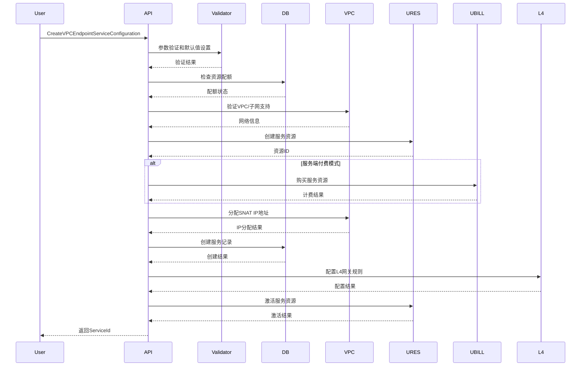
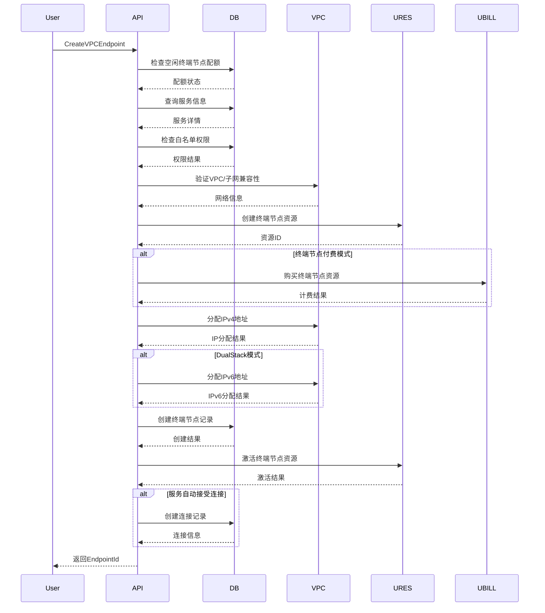
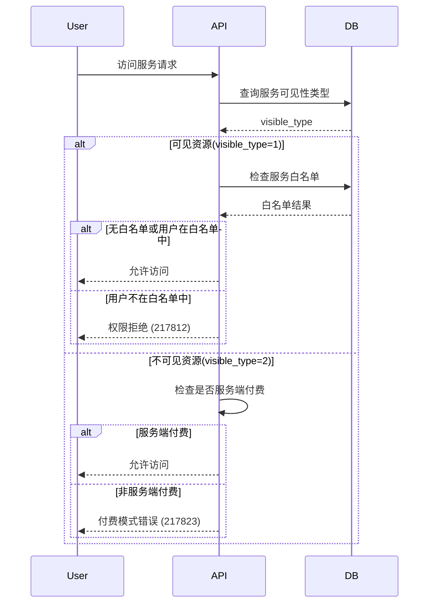

%% state: pending-review | confidence: 9 | type: architecture | sources: privatelink/apisvr | stage: L1 | agent: writer | created: 2026-06-29 %%

# PrivateLink — 核心概念与架构

## 定位
PrivateLink是提供私有网络连接的云服务平台，实现跨VPC的安全、高性能私有连接。支持服务提供商在VPC中创建服务，允许授权用户通过终端节点访问，避免公网暴露和安全风险。

## 技术栈
|| 层 | 技术 | 节点数 | 说明 |
|------|------|:------:|------|
| API | Gin + gRPC | 363 | RESTful接口框架 |
| 业务逻辑 | Go | 1215 | 业务规则和流程处理 |
| 数据访问 | GORM + MySQL | 287 | 数据库操作封装 |
| 外部集成 | 工厂模式 | 422 | 外部系统交互层 |

## 核心功能
- **VPC终端节点服务管理**：创建、配置、查询、更新和删除VPC终端节点服务
- **VPC终端节点管理**：创建、删除、查询和更新终端节点
- **连接管理**：接受、拒绝、查询和更新终端节点连接
- **用户/白名单管理**：服务级别的访问控制和权限管理
- **网络资源配置**：IP地址分配、带宽控制、网络协议版本管理

## 服务结构
```
apisvr/
├── api/                    # HTTP API处理层
│   ├── CreateVPCEndpoint.go                           [[源文件:L1-366]]
│   ├── DeleteVPCEndpoint.go                           [[源文件:L1-150]]
│   ├── DescribeVPCEndpoints.go                        [[源文件:L1-157]]
│   ├── UpdateVPCEndpointAttribute.go                  [[源文件:L1-97]]
│   ├── CreateVPCEndpointServiceConfiguration.go       [[源文件:L1-427]]
│   ├── DeleteVPCEndpointServiceConfiguration.go       [[源文件:L1-36]]
│   ├── UpdateVPCEndpointServiceConfiguration.go       [[源文件:L1-358]]
│   ├── DescribeVPCEndpointServiceConfiguration.go     [[源文件:L1-149]]
│   ├── DescribeVPCEndpointServices.go                 [[源文件:L1-57]]
│   └── ... (共30+个接口文件)
├── factory/              # 外部系统集成层
│   ├── uresource/        # 资源平台交互
│   ├── vpc/              # VPC网络交互 (basic.go: 422行) [[源文件:L1-422]]
│   ├── ubill/            # 计费系统交互
│   └── l4/               # L4网关管理
├── db/                   # 数据访问层
│   ├── model/            # 数据模型定义
│   ├── query/            # 数据库查询封装
│   └── db.go             # 数据库配置和连接管理
└── server.go            # 服务主入口
```

## 1. 核心业务概念

### 1.1 VPC终端节点服务 (VPC Endpoint Service)
**定义**: 服务提供商在VPC中创建的共享服务，允许其他VPC通过终端节点连接访问。

**关键属性**: [[源文件:base.go:L51-L68]]
| 属性 | 类型 | 说明 | 业务约束 |
|------|------|------|----------|
| ServiceId | string | 服务唯一标识 | 自动生成，格式：plsvc-xxxxxxxx |
| Description | string | 服务描述 | 可选，最大255字符 |
| Name | string | 服务名称 | 可选，用于服务发现 |
| Tag | string | 业务标签 | 用于分类和过滤 |
| AutoAcceptEnabled | bool | 自动接受连接 | true：创建终端节点时自动接受连接 |
| Payer | string | 付费方类型 | "endpoint"或"endpointservice" |
| VPCId | string | 所属VPC ID | 必须存在于VPC系统 |
| SubnetId | string | 所属子网ID | 必须存在于子网系统 |
| IPVersion | string | IP协议版本 | "ipv4"或"dualstack" |
| ConnectBandwidth | uint32 | 连接带宽(Mbps) | 100-10000范围 [[源文件:GetPrivateLinkBandwidth.go:L31-L32]] |
| ResourceType | string | 后端资源类型 | "ALB"、"NLB"、"IP" |
| ResourceId | string | 后端资源ID | 资源平台中的资源标识 |
| ResourceIP | string | 后端资源IP | 负载均衡器IP地址 |
| SnatIPs | []string | SNAT IP列表 | 最多4个IP对，支持IPv4/IPv6 |

**业务角色**: 服务提供者，资源拥有者，计费责任方（如果配置为endpointservice付费模式）

### 1.2 VPC终端节点 (VPC Endpoint)
**定义**: 消费者VPC中连接到终端节点服务的网络端点。

**关键属性**: [[源文件:base.go:L33-L49]]
| 属性 | 类型 | 说明 | 业务约束 |
|------|------|------|----------|
| EndpointId | string | 终端节点唯一标识 | 自动生成，格式：plendp-xxxxxxxx |
| Name | string | 终端节点名称 | 可选，最大255字符 |
| Tag | string | 业务标签 | 用于分类和过滤 |
| VPCId | string | 所属VPC ID | 消费者VPC标识 |
| SubnetId | string | 所属子网ID | 消费者子网标识 |
| IPVersion | string | IP协议版本 | 必须与服务兼容 |
| IPv4Address | string | IPv4地址 | 由VPC系统分配 |
| IPv6Address | string | IPv6地址 | DualStack模式时自动分配 |
| ServiceId | string | 关联的服务ID | 必须存在且状态正常 |
| ServiceDescription | string | 服务描述 | 从服务配置继承 |
| ConnectBandwidth | uint32 | 连接带宽(Mbps) | 不能超过服务带宽 |
| Payer | string | 付费方类型 | 继承自服务配置或覆盖 |
| ConnectionStatus | string | 连接状态 | "pending"、"accepted"、"rejected"、"disconnected" |
| CreateTime | uint32 | 创建时间 | Unix时间戳 |
| UpdateTime | uint32 | 更新时间 | Unix时间戳 |

**业务角色**: 服务消费者，网络连接发起方，计费责任方（如果配置为endpoint付费模式）

### 1.3 终端节点连接 (Endpoint Connection)
**定义**: 终端节点与终端节点服务之间的连接关系，代表一次已建立的私有网络连接。

**关键属性**: [[源文件:base.go:L79-L87]]
| 属性 | 类型 | 说明 | 业务约束 |
|------|------|------|----------|
| ServiceId | string | 服务ID | 连接的目标服务 |
| Owner | uint32 | 所有者标识 | 服务拥有者的公司ID |
| EndpointId | string | 终端节点ID | 连接的发起端 |
| ConnectBandwidth | uint32 | 连接带宽(Mbps) | 实际建立的带宽 |
| ConnectionStatus | string | 连接状态 | "active"、"pending"、"rejected" |
| CreateTime | uint32 | 创建时间 | Unix时间戳 |
| UpdateTime | uint32 | 更新时间 | Unix时间戳 |

**业务角色**: 连接关系记录，用于计费、监控和审计

### 1.4 用户/白名单 (Users/Whitelist)
**定义**: 服务级别的访问控制列表，限制哪些用户可以创建终端节点连接到该服务。

**关键属性**: [[源文件:base.go:L89-L97]]
| 属性 | 类型 | 说明 | 业务约束 |
|------|------|------|----------|
| CompanyId | uint32 | 公司ID | 允许访问的公司标识 |
| Remark | string | 备注 | 可选的备注信息 |
| CreateTime | int | 创建时间 | Unix时间戳 |

**访问控制策略**:
1. **无白名单**: 服务对所有用户可见（默认公开策略）
2. **有白名单**: 仅白名单中的公司可以访问
3. **权限继承**: 同一个组织下的账户自动继承权限

## 2. 分层架构设计

### 2.1 API层（HTTP接口层）
**职责**: 请求路由、参数验证、响应格式化、错误处理

**核心组件**:
- **Gin路由器**: HTTP请求路由和中间件处理
- **请求验证器**: 参数类型、范围、必填验证
- **响应构建器**: 统一响应格式，包含Action和RetCode
- **监控收集器**: 请求成功率、响应时间指标收集

**接口分类**: [[源文件:interfaces.md]]
| 接口组 | 接口数 | 典型接口 | 复杂度 |
|--------|:------:|----------|:------:|
| VPC终端节点管理 | 5 | CreateVPCEndpoint (366行) | 高 |
| VPC终端节点服务管理 | 11 | CreateVPCEndpointServiceConfiguration (427行) | 高 |
| 连接管理 | 4 | AcceptVPCEndpointConnection (83行) | 中 |
| 用户/白名单管理 | 4 | AddUsersToVPCEndpointService (119行) | 中 |
| 实用工具接口 | 3 | GetPrivateLinkPrice (68行) | 低 |

### 2.2 业务逻辑层
**职责**: 业务规则处理、状态机管理、并发控制、事务管理

**核心模式**:
1. **状态机管理**: 资源状态转换和验证
2. **配额管理**: 各种配额检查和限制
3. **权限验证**: 组织级别和白名单验证
4. **并发控制**: 数据库乐观锁和行级锁

**关键业务规则**: [[源文件:error.go]]
1. **可见性约束**: 不可见资源必须服务端付费 [[源文件:error.go:L38]]
2. **连接配额**: 服务同时连接的终端节点数量限制
3. **带宽范围**: 100-10000 Mbps的带宽限制
4. **网络兼容性**: IP版本和协议兼容性检查

### 2.3 数据访问层
**职责**: 数据持久化、缓存管理、事务处理、查询优化

**数据模型**: [[源文件:db/model/]]
| 表名 | 用途 | 关键字段 |
|------|------|----------|
| t_service | 终端节点服务配置 | service_id, resource_type, payer, auto_accept |
| t_vpc_endpoint | 终端节点信息 | endpoint_id, service_id, vnet_id, connect_status |
| t_service_whitelist | 服务白名单 | service_id, company_id, remark |
| t_connect_info | 连接信息 | endpoint_id, service_id, start_time, end_time |
| t_user_config | 用户配置 | company_id, account_id, config_key, config_value |

**查询优化策略**:
1. **索引设计**: 关键查询字段建立联合索引
2. **分页查询**: 大数据量查询的分页支持
3. **读写分离**: 主库写，从库读
4. **缓存预热**: 热点数据预加载到缓存

### 2.4 工厂层（外部系统集成）
**职责**: 外部系统抽象、错误重试、连接池管理、降级处理

**工厂接口**: [[源文件:factory/factory.go:L12-20]]
```go
type Factory struct {
    VPC       *vpc.VPCImpl        // VPC网络系统
    UResource *uresource.ResourceImpl  // 资源平台
    Ubill     *ubill.UBillImpl    // 计费系统
    L4        *l4.L4Impl          // L4网关系统
    UAccount  *uaccount.AccountImpl    // 账户系统
}
```

**集成模式**:
1. **统一接口**: 所有外部系统使用统一的请求/响应接口
2. **错误重试**: 指数退避重试机制
3. **超时控制**: 可配置的超时时间
4. **监控埋点**: 每个外部调用都记录监控指标

## 3. 关键业务流程

### 3.1 服务创建流程
**场景**: 服务提供商创建VPC终端节点服务



**关键步骤**: [[源文件:CreateVPCEndpointServiceConfiguration.go]]
1. **参数验证**: 验证必填参数和业务规则 (L30-80)
2. **配额检查**: 检查服务配额和资源限制 (L85-95)
3. **网络验证**: 验证VPC和子网支持情况 (L100-120)
4. **资源创建**: 在资源平台创建服务资源 (L125-150)
5. **IP分配**: 分配SNAT IP地址 (L155-180)
6. **计费处理**: 根据付费模式进行计费 (L185-200)
7. **数据持久化**: 创建数据库记录 (L205-220)
8. **网络配置**: 配置L4网关和路由 (L225-250)
9. **资源激活**: 激活服务使其可用 (L255-270)

### 3.2 终端节点创建流程
**场景**: 用户创建终端节点连接到服务



**关键步骤**: [[源文件:CreateVPCEndpoint.go:L73-264]]
1. **配额检查**: 空闲终端节点配额 (L85-94)
2. **服务验证**: 服务存在性和状态检查 (L97-115)
3. **权限检查**: 白名单权限验证 (L144-168)
4. **网络验证**: VPC/子网兼容性检查 (L170-188)
5. **资源创建**: 在资源平台创建终端节点资源 (L266-286)
6. **计费处理**: 根据付费模式计费 (L204-211)
7. **IP分配**: IPv4/IPv6地址分配 (L213-239)
8. **数据持久化**: 创建终端节点记录 (L314-333)
9. **资源激活**: 激活终端节点 (L249-254)
10. **连接建立**: 自动或手动建立连接 (L256-258)

### 3.3 连接建立流程
**场景**: 建立终端节点到服务的连接

**连接状态机**:
```
pending → (accepted/rejected) → active → disconnected
      ↓           ↓               ↓          ↓
   创建时      服务所有者      数据传输     主动断开
```

**自动接受条件**: [[源文件:CreateVPCEndpoint.go:L256-258]]
1. 服务配置中AutoAcceptEnabled=true
2. 用户在白名单中或有访问权限
3. 所有资源和网络配置正常

**手动接受流程**: [[源文件:AcceptVPCEndpointConnection.go]]
1. 服务所有者调用AcceptVPCEndpointConnection
2. 验证连接状态为pending
3. 更新连接状态为accepted
4. 通知网络系统建立连接通道

### 3.4 访问控制流程
**场景**: 用户请求访问需要白名单的服务



**访问控制规则**: [[源文件:error.go:L27-L38]]
1. **可见资源**: 严格检查白名单，允许endpoint和endpointservice两种付费模式
2. **不可见资源**: 必须是服务端付费模式，跳过白名单检查

## 4. 内部 vs 公共API设计

### 4.1 公共API (External)
**目标用户**: 外部客户、第三方集成

**接口特点**:
- 完整的参数验证和错误处理
- 用户友好的错误消息
- 严格的权限和配额检查
- 详细的审计日志
- 标准化响应格式

**典型接口**: CreateVPCEndpoint, DescribeVPCEndpoints, UpdateVPCEndpointAttribute

### 4.2 内部API (Internal)
**目标用户**: 内部系统、运维工具、自动化脚本

**接口特点**:
- 简化的参数验证
- 绕过某些业务规则检查
- 支持批量操作
- 返回原始数据格式
- 更高的权限级别

**典型接口**: 
- **IDeleteVPCEndpoint**: 强制删除终端节点，忽略可见性检查
- **IDescribeVPCEndpointServiceConfiguration**: 查询所有可见性类型的服务
- **IDeleteVPCEndpointServiceConfiguration**: 强制删除服务，忽略连接检查

**设计原则**:
1. **命名约定**: 内部接口以"I"前缀标识
2. **权限分离**: 内部接口需要特殊权限
3. **风险控制**: 内部接口操作记录详细审计日志
4. **向后兼容**: 保持接口稳定性，不轻易修改

## 5. 错误处理与验证模式

### 5.1 错误码体系
**错误码范围**: [[源文件:error.go:L53-L80]]
| 错误分类 | 错误码范围 | 代表错误 | 处理策略 |
|----------|------------|----------|----------|
| 通用错误 | 100-999 | 230 (参数错误) | 前置验证，立即返回 |
| PrivateLink错误 | 217801-217827 | 24个特定错误 | 业务逻辑检查 |
| 内部错误 | 500 | InternalServerErr | 触发回滚，记录日志 |

**关键业务错误**:
| 错误码 | 错误名称 | 触发条件 | 解决建议 |
|--------|----------|----------|----------|
| 217801 | NotSupportNLBErr | 尝试创建NLB类型的服务 | 使用ALB或IP类型 |
| 217803 | ResourceNotFoundErr | 资源不存在或已删除 | 检查资源ID是否正确 |
| 217812 | PermissionIsDeniedErr | 白名单权限验证失败 | 申请服务访问权限 |
| 217818 | IdleEPQuotaExceededErr | 空闲终端节点配额超限 | 删除未使用的终端节点 |
| 217821 | ServiceHasBeenClosedErr | 服务已关闭 | 联系服务提供商 |
| 217823 | InvisibleEndpointPayerErr | 不可见资源非服务端付费 | 修改为服务端付费模式 |
| 217824 | ConnectEPQuotaExceededErr | 服务连接配额超限 | 等待其他连接释放 |
| 217825 | ResourceQuotaExceededErr | 资源配额超限 | 申请配额提升 |
| 217827 | VPCAllocateIPErr | VPC分配IP失败 | 检查子网IP容量 |

### 5.2 验证模式
**参数验证层级**: [[源文件:CreateVPCEndpoint.go:L77-83]]
1. **基础验证**: 数据类型、必填字段、格式检查
2. **业务验证**: 取值范围、枚举值、组合约束
3. **系统验证**: 资源存在性、状态检查、配额验证
4. **权限验证**: 组织权限、白名单、付费模式

**验证框架特性**:
- **统一验证**: 所有接口使用相同的验证框架
- **错误消息**: 清晰的错误提示和解决建议
- **默认值**: 合理的默认值设置减少用户配置
- **兼容性**: 向后兼容的参数处理

### 5.3 事务与回滚机制
**原子操作设计**: [[源文件:CreateVPCEndpoint.go:L335-366]]
```go
// 回滚函数，按创建顺序的逆序清理
func (a *API) rollbackEndpoint(
    ctx context.Context,
    req *CreateVPCEndpointReq,
    endpointID string,
    hasResource,        // 资源已创建
    hasBuyResource,     // 计费已购买
    hasIPv4,           // IPv4已分配
    hasIPv6,           // IPv6已分配
    hasEndpointInDB    // 数据库记录已创建
) {
    if hasEndpointInDB {
        a.db.DeleteVPCEndpointSoft(ctx, endpointID, req.OrgID)
    }
    if hasIPv4 {
        a.fac.VPC.FreeIPv4sByIPs(ctx, regionID, orgID, subnetID, endpointID, []string{ipv4})
    }
    // ... 其他清理操作
}
```

**回滚策略**:
1. **状态跟踪**: 记录每个步骤的完成状态
2. **逆序清理**: 按创建顺序的逆序执行清理
3. **幂等设计**: 清理操作支持重试和幂等
4. **异步补偿**: 长时间操作使用异步补偿事务

### 5.4 监控与告警
**监控指标**:
1. **业务指标**: 创建成功率、错误率、配额使用率
2. **性能指标**: API响应时间、数据库查询时间、外部调用延迟
3. **资源指标**: CPU使用率、内存使用率、连接数
4. **网络指标**: 网络延迟、丢包率、带宽使用率

**告警阈值**:
- **创建成功率**: < 99% (P1告警)
- **API错误率**: > 5% (P2告警)
- **响应时间**: > 1秒 (P3告警)
- **数据库查询**: > 500ms (P3告警)

## 6. 系统集成架构

### 6.1 外部系统依赖
| 系统 | 用途 | 集成方式 | 关键接口 |
|------|------|----------|----------|
| VPC系统 | 网络资源管理 | HTTP API | AllocateIPv4, GetVPCInfo |
| 资源平台 | 资源生命周期 | HTTP API | CreateResource, ActivateResource |
| 计费系统 | 资源计费 | HTTP API | PostPaidCreate, PostPaidDelete |
| L4网关 | 网络流量转发 | HTTP API | CreateForwardRule, DeleteForwardRule |
| 账户系统 | 用户认证 | HTTP API | VerifyPermission, GetOrgInfo |

### 6.2 集成模式
**工厂模式设计**: [[源文件:factory/factory.go:L12-20]]
1. **统一抽象**: 所有外部系统通过工厂接口访问
2. **配置驱动**: 连接配置外部化管理
3. **连接池**: 复用HTTP连接减少开销
4. **超时重试**: 可配置的超时和重试策略

**监控集成**: [[源文件:factory/vpc/basic.go:L262-272]]
```go
func (i *VPCImpl) APIRequestWithMetrics(ctx context.Context, req common.IBaseRequest, 
    resp common.IBaseResponse, timeout ...uint32) (err error) {
    
    backend, action := req.GetBackend(), req.GetAction()
    xpro.ClientRequestSentTotal.WithLabelValues("api", backend, action).Inc()
    
    startTime := time.Now()
    defer func() {
        xpro.ClientResponseReceivedTotal.WithLabelValues("api", backend, action, 
            strconv.Itoa(resp.GetRetCode())).Inc()
        delay := time.Since(startTime).Milliseconds()
        xpro.ClientResponseDuration.WithLabelValues(action, "http", backend).Observe(float64(delay))
    }()
    
    return i.APIRequest(ctx, req, resp, timeout...)
}
```

## 7. 部署与运维架构

### 7.1 部署拓扑
**多可用区高可用部署**:
```
Region (地域)
├── Availability Zone 1
│   ├── APISVR集群 (3节点)
│   ├── 数据库主节点
│   └── Redis主节点
├── Availability Zone 2
│   ├── APISVR集群 (3节点)
│   ├── 数据库从节点
│   └── Redis从节点
└── 全局服务
    ├── 监控中心 (Prometheus)
    ├── 日志中心 (ELK)
    └── 配置中心 (Consul)
```

### 7.2 容量规划
| 资源类型 | 规格 | 数量 | 用途 |
|----------|------|------|------|
| API服务 | 4C8G | 6节点 | 业务处理，2个可用区各3节点 |
| 数据库 | 8C16G | 3节点 | 1主2从，数据存储 |
| 缓存 | 4C8G | 3节点 | Redis集群，会话和缓存 |
| 消息队列 | 4C8G | 3节点 | Kafka集群，异步处理 |

### 7.3 安全架构
**认证授权**:
1. **API密钥**: 客户端使用API密钥进行认证
2. **组织隔离**: 不同组织的数据完全隔离
3. **操作审计**: 所有操作记录审计日志

**网络安全**:
1. **VPC隔离**: 不同客户的VPC网络隔离
2. **私有连接**: 使用私有网络连接，不经过公网
3. **加密传输**: 数据传输使用TLS 1.3加密

**数据安全**:
1. **数据加密**: 敏感数据AES-256加密存储
2. **访问控制**: 基于角色的最小权限原则
3. **数据备份**: 每天全量备份，每小时增量备份

## AST 指标
| 指标 | 值 | 说明 |
|------|:--:|------|
| 节点 | 1215 | 代码AST节点总数 |
| 边 | 2233 | 节点间依赖关系总数 |
| 社区 | 74 | 模块化分组数量 |
| God 节点 | Logger (47 边) | 最核心的依赖节点 |

## 相关页面
- [[privatelink/apisvr/overview]] - 服务概览
- [[privatelink/apisvr/interfaces]] - 接口文档索引
- [[privatelink/apisvr/core_concepts]] - 核心概念详解
- [[privatelink/apisvr/error_handling]] - 错误处理机制
- [[privatelink/apisvr/architecture]] - 详细架构设计