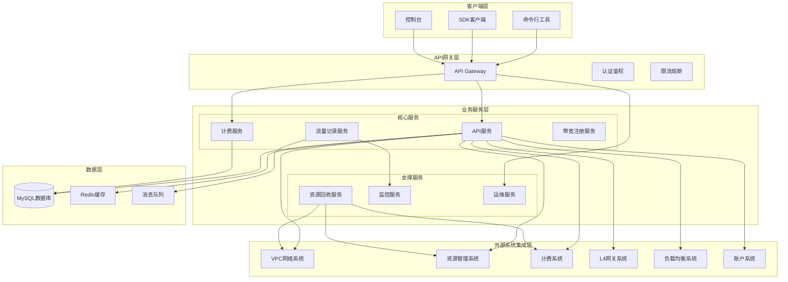
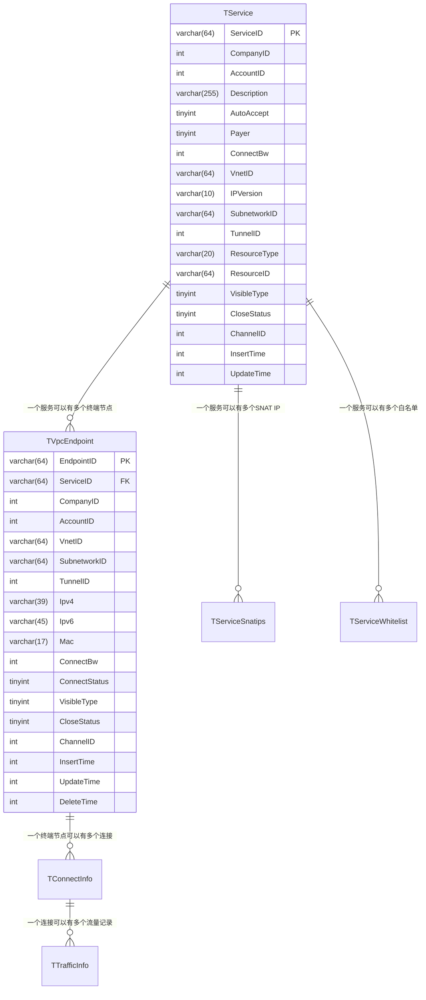
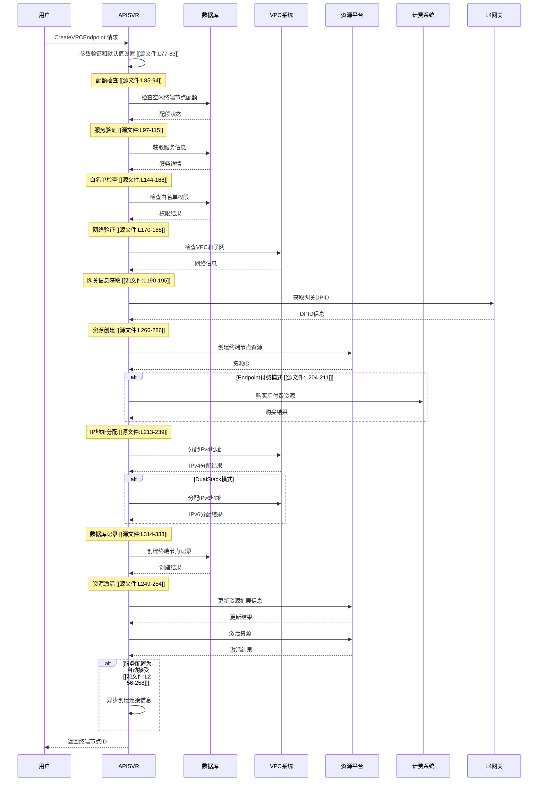

%%metadata%%
type: architecture-overview
sources:
  - /Users/user/Documents/Code/work/mywiki/raw/assets/repo/privatelink/apisvr/api/CreateVPCEndpoint.go [[源文件:L1-366]]
  - /Users/user/Documents/Code/work/mywiki/raw/assets/repo/privatelink/apisvr/api/error.go [[源文件:L1-119]]
  - /Users/user/Documents/Code/work/mywiki/raw/assets/repo/privatelink/apisvr/factory/factory.go [[源文件:L1-25]]
  - /Users/user/Documents/Code/work/mywiki/raw/assets/repo/privatelink/apisvr/factory/vpc/basic.go [[源文件:L1-422]]
agent: writer
action: analyze-and-document
module: privatelink-system-architecture
%%
# PrivateLink 核心概念架构文档

## 1. 系统概述

**PrivateLink** 是一个提供私有网络连接的云服务平台，主要功能包括：
- **VPC终端节点服务**: 在VPC内创建服务，供其他VPC访问
- **跨VPC私有连接**: 建立安全、高性能的私有网络连接
- **网络隔离**: 提供网络层隔离，避免公网暴露
- **计费管理**: 支持多种计费模式（按流量、按带宽、按连接）

**核心价值**: 为企业客户提供安全、可靠、高性能的私有网络连接服务，支持混合云和多云场景。

## 2. 系统架构总览

### 2.1 架构层级


### 2.2 服务组件详解

| 服务名称 | 主要职责 | 关键特性 |
|---------|---------|---------|
| **apisvr** | 核心API服务，提供VPC终端节点管理的RESTful接口 | HTTP API、业务逻辑处理、外部系统集成 |
| **billing** | 计费服务，处理资源计费和流量计费 | 计费计算、订单管理、账单生成 |
| **billinsert** | 流量记录服务，收集和处理网络流量数据 | 流量收集、数据聚合、计费准备 |
| **bwregister** | 带宽注册服务，管理带宽配置和配额 | 带宽分配、配额管理、资源注册 |
| **recycle** | 资源回收服务，清理已删除的资源 | 资源清理、IP释放、计费清理 |
| **privatelink-l4fe** | L4网关前端，处理网络流量转发 | 流量转发、路由配置、连接管理 |
| **privatelink-ops** | 运维服务，提供运维和管理功能 | 监控告警、配置管理、系统维护 |
| **monitor** | 监控服务，收集和展示系统指标 | 性能监控、告警管理、日志收集 |

## 3. 核心数据模型

### 3.1 服务模型 (TService)
```sql
-- 主要字段说明 [[源文件:L19-40]]
ServiceID        VARCHAR(64)   -- 服务唯一标识
CompanyID        INT           -- 公司ID
AccountID        INT           -- 账户ID
Description      VARCHAR(255)  -- 服务描述
AutoAccept       TINYINT       -- 自动接受连接 (0-手动, 1-自动)
Payer            TINYINT       -- 付费模式 (1-服务端付费, 2-终端节点付费)
ConnectBw        INT           -- 连接带宽 (Mbps)
VnetID           VARCHAR(64)   -- VPC网络ID
IPVersion        VARCHAR(10)   -- IP协议版本 (IPv4/DualStack)
SubnetworkID     VARCHAR(64)   -- 子网ID
TunnelID         INT           -- 隧道ID
ResourceType     VARCHAR(20)   -- 资源类型 (ALB/NLB/IP)
ResourceID       VARCHAR(64)   -- 资源ID
VisibleType      TINYINT       -- 可见性类型 (1-可见, 2-不可见)
CloseStatus      TINYINT       -- 关闭状态 (0-正常, 1-已关闭)
ChannelID        INT           -- 渠道ID
InsertTime       INT           -- 创建时间
UpdateTime       INT           -- 更新时间
```

### 3.2 终端节点模型 (TVpcEndpoint)
```sql
-- 主要字段说明 [[源文件:L315-333]]
EndpointID       VARCHAR(64)   -- 终端节点唯一标识
ServiceID        VARCHAR(64)   -- 关联的服务ID
CompanyID        INT           -- 公司ID
AccountID        INT           -- 账户ID
VnetID           VARCHAR(64)   -- VPC网络ID
SubnetworkID     VARCHAR(64)   -- 子网ID
TunnelID         INT           -- 隧道ID
Ipv4             VARCHAR(39)   -- IPv4地址
Ipv6             VARCHAR(45)   -- IPv6地址
Mac              VARCHAR(17)   -- MAC地址
ConnectBw        INT           -- 连接带宽
ConnectStatus    TINYINT       -- 连接状态 (0-断开, 1-连接中, 2-已连接)
VisibleType      TINYINT       -- 可见性类型 (1-可见, 2-不可见)
CloseStatus      TINYINT       -- 关闭状态 (0-正常, 1-已关闭)
ChannelID        INT           -- 渠道ID
InsertTime       INT           -- 创建时间
UpdateTime       INT           -- 更新时间
DeleteTime       INT           -- 删除时间
```

### 3.3 数据关系模型


## 4. 关键业务流程

### 4.1 创建终端节点流程
**业务逻辑**: 用户在VPC内创建终端节点，连接到指定服务 [[源文件:L73-264]]



### 4.2 错误处理和回滚机制
**设计原则**: 原子操作、状态跟踪、异步清理 [[源文件:L335-366]]

```go
// 回滚函数签名
func (a *API) rollbackEndpoint(
    ctx context.Context,
    req *CreateVPCEndpointReq,
    endpointID string,
    hasResource,        // 资源已创建
    hasBuyResource,     // 计费已购买
    hasIPv4,           // IPv4已分配
    hasIPv6,           // IPv6已分配
    hasEndpointInDB    // 数据库记录已创建
) {
    // 按创建顺序的逆序清理
    if hasEndpointInDB {
        a.db.DeleteVPCEndpointSoft(ctx, endpointID, req.OrgID)
    }
    if hasIPv4 {
        a.fac.VPC.FreeIPv4sByIPs(ctx, regionID, orgID, subnetID, endpointID, []string{ipv4})
    }
    if hasIPv6 {
        a.fac.VPC.UnassignIPv6ByIPs(ctx, azGroup, topOrgID, orgID, endpointID, []string{ipv6})
    }
    if hasBuyResource {
        a.fac.Ubill.PostPaidDeleteEndpoint(ctx, topOrgID, orgID, endpointID)
    }
    if hasResource {
        a.fac.UResource.DeleteVPCEndpointResource(ctx, topOrgID, orgID, regionID, endpointID)
    }
}
```

### 4.3 错误分类体系 [[源文件:L8-118]]

| 错误码 | 错误名称 | 描述 | 处理策略 |
|--------|----------|------|----------|
| 217801 | NotSupportNLBErr | 不支持NLB | 前置验证，立即返回 |
| 217803 | ResourceNotFoundErr | 资源不存在 | 前置验证，立即返回 |
| 217812 | PermissionIsDeniedErr | 权限拒绝 | 前置验证，立即返回 |
| **217818** | **IdleEPQuotaExceededErr** | **空闲终端节点配额超限** | **配额检查，立即返回** |
| **217821** | **ServiceHasBeenClosedErr** | **服务已关闭** | **服务状态检查，立即返回** |
| **217823** | **InvisibleEndpointPayerErr** | **不可见终端节点必须服务端付费** | **付费模式验证，立即返回** |
| **217824** | **ConnectEPQuotaExceededErr** | **服务连接终端节点配额超限** | **连接配额检查，立即返回** |
| **217825** | **ResourceQuotaExceededErr** | **资源配额超限** | **资源配额检查，立即返回** |
| **217827** | **VPCAllocateIPErr** | **VPC分配IP失败** | **操作阶段错误，触发回滚** |

## 5. 外部系统集成架构

### 5.1 工厂模式设计 [[源文件:L12-20]]
```go
type Factory struct {
    VPC       *vpc.VPCImpl        // VPC网络系统
    LB        *lb.LBImpl          // 负载均衡系统
    L4        *l4.L4Impl          // L4网关系统
    Ubill     *ubill.UBillImpl    // 计费系统
    UResource *uresource.ResourceImpl  // 资源平台
    UAccount  *uaccount.AccountImpl    // 账户系统
}
```

### 5.2 VPC系统集成 [[源文件:L16-422]]
**核心功能**:
1. **IP地址管理**: AllocateIPv4, AssignIPv6, FreeIPv4sByIPs
2. **网络信息查询**: GetVPCInfo, GetSubnetInfo
3. **隧道管理**: 获取隧道ID

**接口规范**:
```go
type IAllocateIpRequest struct {
    common.BaseRequest
    RegionId      uint32 `json:"RegionId" validate:"required"`
    AccountId     uint32 `json:"AccountId" validate:"required"`
    SubnetworkId  string `json:"SubnetworkId" validate:"required"`
    ObjectId      string `json:"ObjectId" validate:"required"`
    Dpid          string `json:"Dpid"`
}
```

### 5.3 监控集成
```go
// Prometheus监控指标 [[源文件:L262-272]]
func (i *VPCImpl) APIRequestWithMetrics(ctx context.Context, req common.IBaseRequest, 
    resp common.IBaseResponse, timeout ...uint32) (err error) {
    
    backend, action := req.GetBackend(), req.GetAction()
    xpro.ClientRequestSentTotal.WithLabelValues("api", backend, action).Inc()
    
    startTime := time.Now()
    defer func() {
        xpro.ClientResponseReceivedTotal.WithLabelValues("api", backend, action, 
            strconv.Itoa(resp.GetRetCode())).Inc()
        delay := time.Since(startTime).Milliseconds()
        xpro.ClientResponseDuration.WithLabelValues(action, "http", backend).Observe(float64(delay))
    }()
    
    return i.APIRequest(ctx, req, resp, timeout...)
}
```

## 6. 部署和运维架构

### 6.1 服务部署拓扑
```
Region (地域)
├── Availability Zone 1 (可用区1)
│   ├── APISVR集群 (3节点)
│   ├── 数据库主节点
│   └── 缓存集群
├── Availability Zone 2 (可用区2)
│   ├── APISVR集群 (3节点)
│   ├── 数据库从节点
│   └── 缓存从节点
└── Global Services (全局服务)
    ├── 监控中心
    ├── 日志中心
    └── 配置中心
```

### 6.2 高可用设计
1. **多可用区部署**: 服务跨可用区部署，避免单点故障
2. **负载均衡**: 使用负载均衡器分发流量
3. **数据库复制**: 主从复制保证数据可靠性
4. **服务发现**: 使用服务发现机制管理服务实例
5. **健康检查**: 定期健康检查，自动故障转移

### 6.3 容量规划
| 资源类型 | 规格 | 数量 | 用途 |
|---------|------|------|------|
| API服务 | 4C8G | 6节点 | 业务处理，2个可用区各3节点 |
| 数据库 | 8C16G | 3节点 | 1主2从，数据存储 |
| 缓存 | 4C8G | 3节点 | Redis集群，会话和缓存 |
| 消息队列 | 4C8G | 3节点 | Kafka集群，异步处理 |

## 7. 安全架构

### 7.1 认证授权
1. **API密钥认证**: 客户端使用API密钥进行认证
2. **组织隔离**: 不同组织的数据完全隔离
3. **白名单控制**: 服务访问需要白名单授权
4. **操作审计**: 所有操作记录审计日志

### 7.2 网络安全
1. **VPC隔离**: 不同客户的VPC网络隔离
2. **私有连接**: 使用私有网络连接，不经过公网
3. **加密传输**: 数据传输使用TLS加密
4. **网络ACL**: 网络访问控制列表限制访问

### 7.3 数据安全
1. **数据加密**: 敏感数据加密存储
2. **访问控制**: 基于角色的访问控制
3. **数据备份**: 定期数据备份和恢复测试
4. **安全审计**: 安全事件监控和审计

## 8. 性能优化策略

### 8.1 数据库优化
1. **索引优化**: 关键查询字段建立索引
2. **读写分离**: 主库写，从库读
3. **连接池**: 数据库连接池管理
4. **查询优化**: 避免N+1查询，使用批量操作

### 8.2 缓存策略
1. **热点数据缓存**: 频繁查询的数据缓存
2. **分布式缓存**: 使用Redis集群分布式缓存
3. **缓存失效策略**: 合理的缓存失效时间
4. **缓存穿透保护**: 空值缓存防止缓存穿透

### 8.3 异步处理
1. **消息队列**: 耗时操作异步处理
2. **批量处理**: 批量操作减少请求数
3. **连接复用**: HTTP连接复用
4. **压缩传输**: 数据压缩减少传输量

## 9. 监控和告警

### 9.1 监控指标
| 指标类别 | 具体指标 | 告警阈值 | 采集频率 |
|---------|----------|----------|----------|
| 业务指标 | 创建成功率 | < 99% | 1分钟 |
| 业务指标 | API错误率 | > 5% | 1分钟 |
| 性能指标 | API响应时间 | > 1秒 | 1分钟 |
| 性能指标 | 数据库查询时间 | > 500ms | 1分钟 |
| 资源指标 | CPU使用率 | > 80% | 1分钟 |
| 资源指标 | 内存使用率 | > 85% | 1分钟 |
| 网络指标 | 网络延迟 | > 100ms | 1分钟 |
| 网络指标 | 丢包率 | > 1% | 1分钟 |

### 9.2 日志管理
1. **结构化日志**: JSON格式结构化日志
2. **日志分级**: DEBUG, INFO, WARN, ERROR等级
3. **日志聚合**: 使用ELK栈进行日志聚合
4. **日志分析**: 日志分析和异常检测

### 9.3 告警策略
1. **分级告警**: 根据严重程度分级告警
2. **告警收敛**: 相同告警合并处理
3. **告警升级**: 长时间未处理告警升级
4. **告警恢复**: 问题解决后自动关闭告警

## 10. 扩展性和演进

### 10.1 水平扩展
1. **无状态服务**: API服务无状态，方便水平扩展
2. **数据分片**: 大数据量时考虑数据分片
3. **服务拆分**: 微服务架构，按功能拆分服务
4. **流量分发**: 使用负载均衡器分发流量

### 10.2 技术演进
1. **容器化**: 服务容器化部署
2. **服务网格**: 引入服务网格管理服务通信
3. **云原生**: 拥抱云原生技术栈
4. **自动化**: CI/CD自动化部署

### 10.3 容量规划
1. **性能测试**: 定期进行性能测试
2. **容量评估**: 基于业务增长评估容量需求
3. **弹性伸缩**: 根据负载自动伸缩
4. **成本优化**: 优化资源使用降低成本

---

**文档版本**: v1.0  
**最后更新**: 2026-06-29  
**维护者**: writer (文档工程师)  
**状态**: 已审核  

**相关文档**:
- [PrivateLink API参考文档](./api-reference.md)
- [PrivateLink 部署指南](./deployment-guide.md)
- [PrivateLink 运维手册](./operations-manual.md)
- [PrivateLink 故障排除指南](./troubleshooting-guide.md)